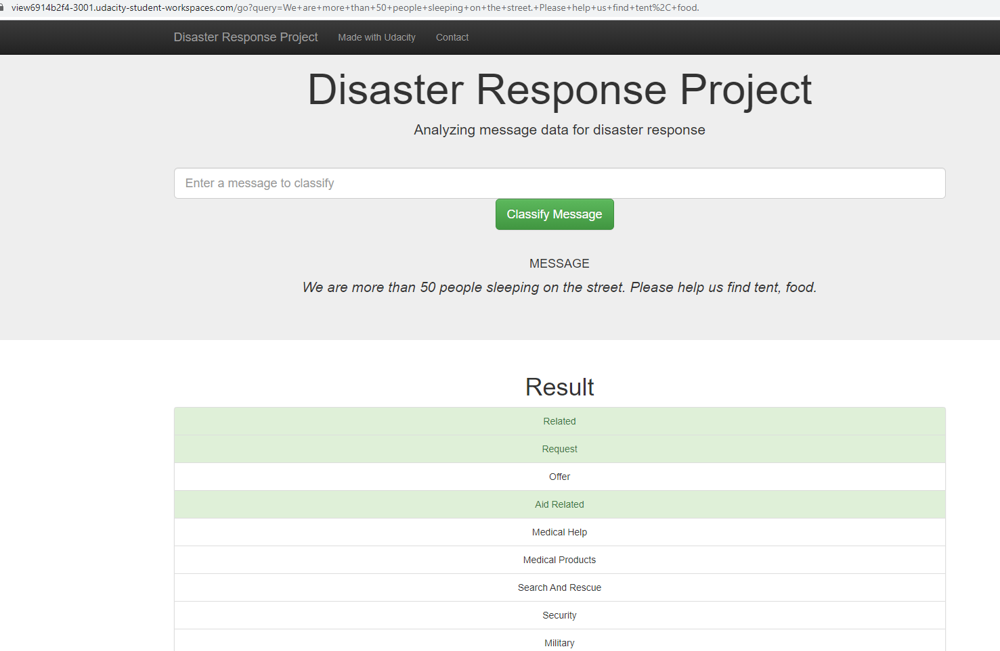
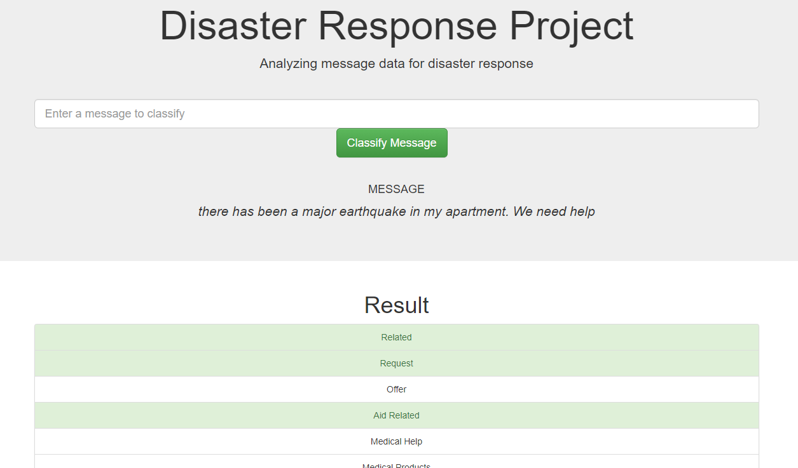
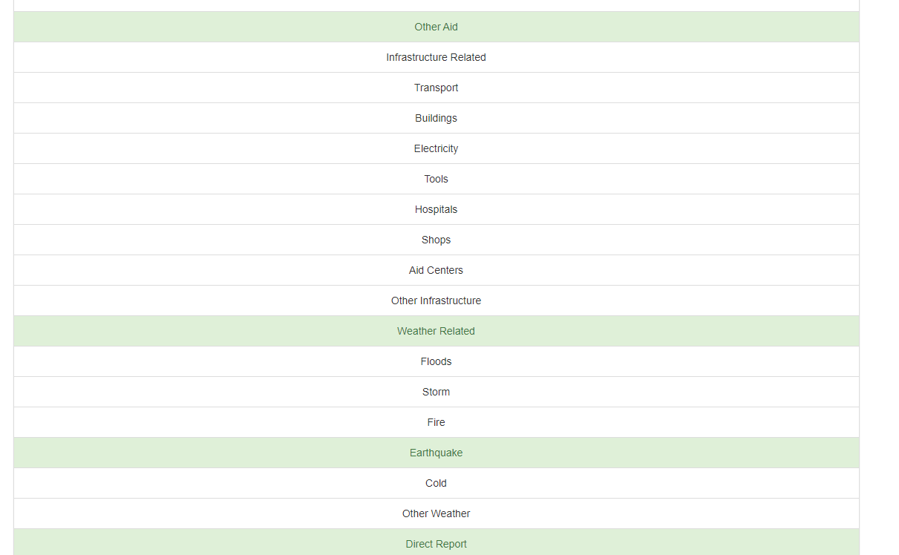

# Disaster Response Pipeline Project

### Project Overview
This project includes a web app that classifies disaster messages. An emergency worker can input a message and get classification results in several categories. 
Using data from Figure Eight, a Histogram-based Gradient Boosting Classification Tree was trained for the API to classify disaster messages. 

### File Description

* data: This folder contains all the .csv files, .db file and .py files associated with the training data
* data-> disaster_categories.csv and disaster_messages.csv: These files contains messages and the  different categories it represents.
* data-> process_data.py: This python script creates an SQLite database containing a merged dataframe and cleaned version of the input messages and categories
* data-> disaster.db: This is the database to pull the data
* models: This folder contains the ML pipeline and the model pickle file
* models-> train_classifier.py: Using the data from the SQLite database, this script is used to train a ML model for categorizing different messages. The output is a pickle file containing the trained model. Evaluation metrics are also printed on the test set.
* models->classifier.pkl: This file contains the trained model 
* app: This folder contains run.py and templates which are used to run the main web application

### Instructions:
1. Run the following commands in the project's root directory to set up your database and model.

    - To run ETL pipeline that cleans data and stores in database
        `python data/process_data.py data/disaster_messages.csv data/disaster_categories.csv data/DisasterResponse.db`
    - To run ML pipeline that trains classifier and saves
        `python models/train_classifier.py data/DisasterResponse.db models/classifier.pkl`

2. Run the following command in the app's directory to run your web app.
    `python run.py`

3. Go to http://0.0.0.0:3001/

### Web App

